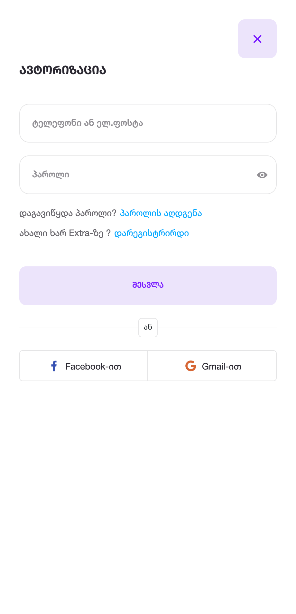
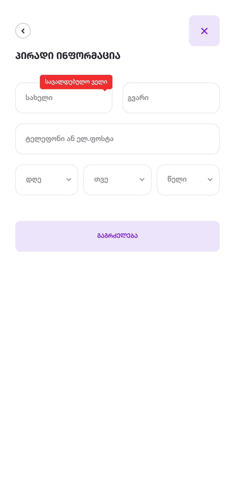
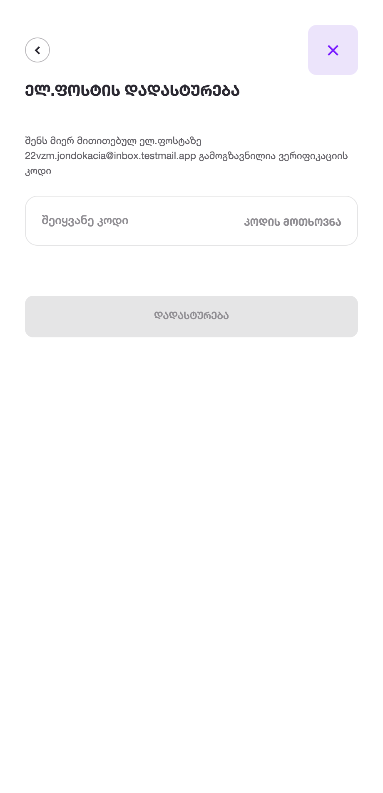
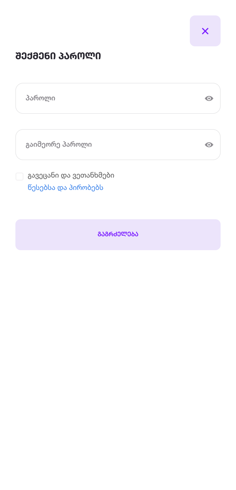

# Test case 01
## User registration

> Precondition: Phone number/e-mail must not be registered

|#  |Step  |Test Data  |Expected Result  |
|--:|---|---|---|
|1| Go to website | https://extra.ge | Home page of the web site loads |
|2| Click the button | შესვლა | Login form appears.  |
|3| Click the link | დარეგისტრირდი | User type choose option appears.  |
|4| Choose user type | ფიზიკური პირი | Registration form step one loads.  |
|5| Enter first name | ჯონდო | First name input fills with the entered data |
|6| Enter last name | კაცია | last name input fills with the entered data |
|7| Enter e-mail | 22vzm.jondokacia@inbox.testmail.app | E-mail input fills with the entered data.  Submit button becomes active |
|8| Click the day selector |  | selector list loads |
|9| Choose day | 4 | Day input value becomes 4 |
|10| Click the month selector |  | selector list loads |
|11| Choose the month | აპრილი | Month input value becomes selected option |
|12| Click the year selector |  | selector list loads |
|11| Choose the year | 1994 | Year selector value becomes selected option |
|12| User clicks the button | გაგრძელება | OTP validation form loads  |
|13| User enters OTP code sent to email |  | otp input field is filled |
|14| User click the button | დადასტურება | Password creation form loads  |
|15| user enters password | someStrong.#$19 | password field is filled with hidden characters |
|16| user enters same password | someStrong.#$19 | assword field is filled with hidden characters |
|17| User checks TOC checkbox |  | Checkbox is checked |
|18| User clicks the button | გაგრძელება | Account creation confirmation message appears 
